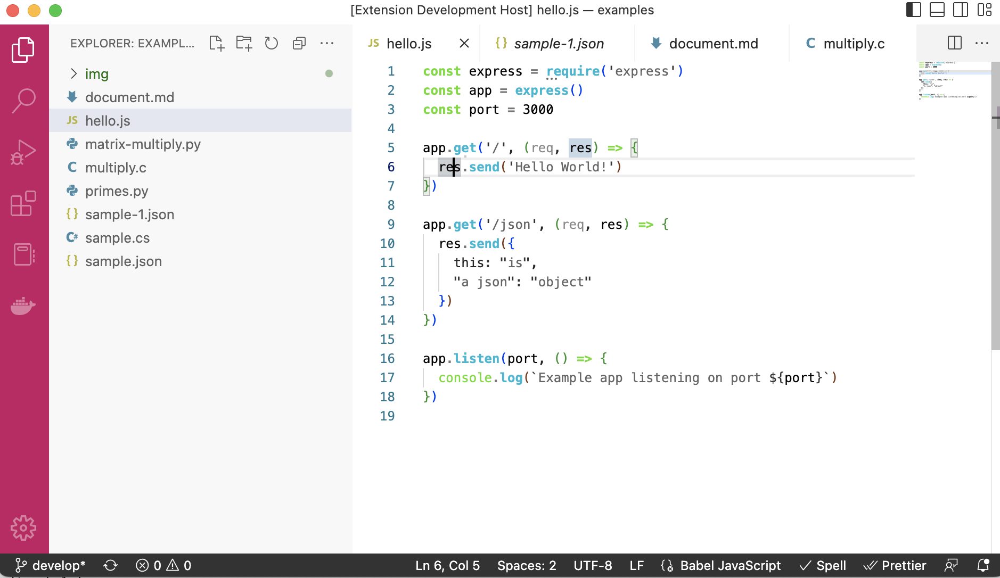

# Triple Dot Themes

This extension provides a set of themes with multi-level JSON highlighting

This is currently the a beta-release and the themes and generators are under refinement.

## Themes

The following themes are included:

**Triple Dot Dark**

The default theme in this bundle. Based on the Triple Dot brand colors.

**Triple Dot Light**

**Triple Dot Black**

**Monokai Neue**

Based on the [Monokai Neue](https://github.com/josh-kaplan/sublime-monokai-neue)
color theme we developed for Sublime Text.

**Microsoft** and **Microsoft Dark**

A color scheme based on the colors found in Microsoft logo. 

**Disclaimer:** These theme is in no way supported or endorsed by Microsoft.

